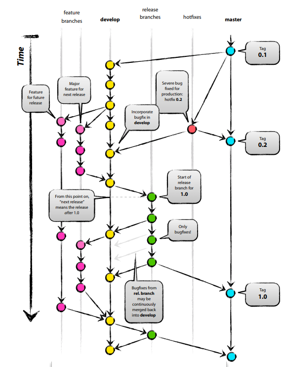
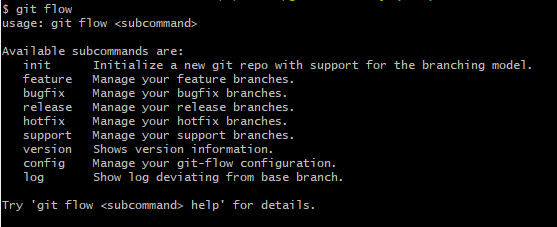

# Git-Flow

## 공부 계기

프로젝트 진행 또는 오픈소스를 개발 할 떄 브랜치 방법이 체계적이지 못해 찾아보았다.

## 설명

Git-Flow 는 `Vincent Driessen` 이라는 사람이 브랜치 전략으로 제시한거다

| 브랜치  | 설명         | 흐름                                       |
| ------- | ------------ | ------------------------------------------ |
| master  | 상용분기     | master ( tag )                             |
| develop | 개발분기     | master -> develop   develop -> release  |
| feature | 기능분기     | develop -> feature   feature -> develop |
| release | 배포분기     | release -> master                          |
| hotfix  | 상용이슈분기 | master -> hotfix -> develop                |
| supoort | 버전호환분기 | master -> support -> develop               |

## 사용하는 방법

git 만 설치되어 있으면 사용 가능하고 cli 에서 사용할 수 있다.  
cli 에서 아래와 같이 사용하면 관련 command 및 설명을 볼 수 있다.

예제를 보고 싶으면 **참고**의 `gitflow-workflow 사용방법` 을 들어가서 보는걸 추천한다.

### 간단 정리

-   develop 생성 : `git flow init -d`
-   feature 생성 : `git flow feature start feature_branch`
-   feature 배포 : `git flow feature publish feature_branch`
-   feature 삭제 : `git flow feature finish feature_branch`
    -   추가 설명 : feature branch 삭제 및 develop 로 merge
-   release 생성 : `git flow release start release_branch`
-   release 배포 : `git flow release publish release_branch`
-   release 삭제 : `git flow release finish release_branch`
    -   추가 설명 : release branch 삭제 및 master 로 merge 및 tag 추가

## 참조

-   [Tistory 정리 글](https://hbase.tistory.com/60)
-   [Vincent Driessen의 Poster](https://nvie.com/posts/a-successful-git-branching-model/)
-   [gitflow-workflow 사용방법](https://www.atlassian.com/git/tutorials/comparing-workflows/gitflow-workflow)
